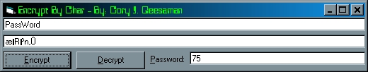



## Encrypt By Char

### Description

i made this for a few diff prjs(and keep losing and remaking the code because it is so cool, so i want to keep a copy saved), if you like it vote, if you have ways to make it better please tell me, and i hope you like it.
 
### More Info
 

             |
---                |---
**Submitted On**   |2001-07-15 03:29:14
**By**             |[Cory J\. Geesaman](https://github.com/Planet-Source-Code/PSCIndex/blob/master/ByAuthor/cory-j-geesaman.md)
**Level**          |Intermediate
**User Rating**    |3.7 (11 globes from 3 users)
**Compatibility**  |VB 5\.0, VB 6\.0
**Category**       |[Encryption](https://github.com/Planet-Source-Code/PSCIndex/blob/master/ByCategory/encryption__1-48.md)
**World**          |[Visual Basic](https://github.com/Planet-Source-Code/PSCIndex/blob/master/ByWorld/visual-basic.md)
**Archive File**   |[Encrypt By227947152001\.zip](https://github.com/Planet-Source-Code/cory-j-geesaman-encrypt-by-char__1-25026/archive/master.zip)

